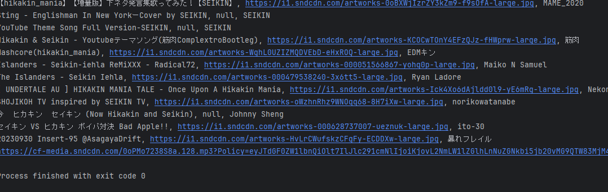

# SC4J
SoundCloud API for Java.
  
## How to use
- Create a class that inherits from SC4J and implement the getHTTP functions.
[Example](https://github.com/wevez/SC4J/blob/main/src/CustomSC4J.javaa)
- Create an instance of your custom SC4J and enjoy your scraping!
[Example](https://github.com/wevez/SC4J/blob/main/src/Main.java)
### An example of the output result of the above code

## This project contains following libraries.
- [gson](https://github.com/google/gson) Parser for .json file.
